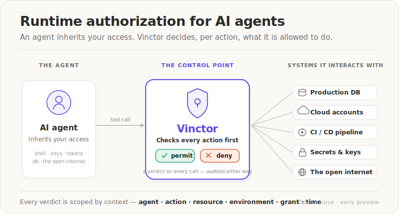
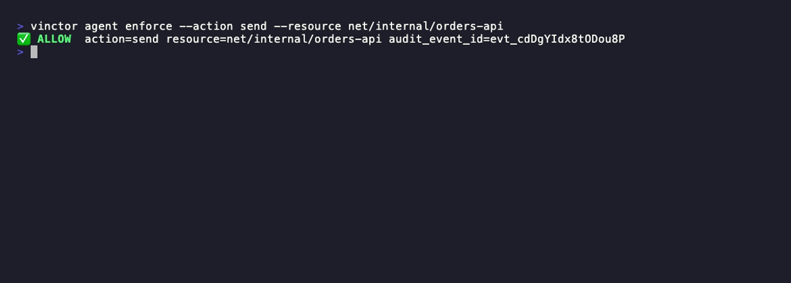

# vinctor-core

Deterministic authorization core for mediated AI-agent actions. The core answers
one question — *should this agent action be allowed under its grant?* — and
returns a reviewable `permit`/`deny`, staying independent of any runtime,
database, or HTTP stack.

> Status: early prototype. APIs and package boundaries may change.



## Purpose

`vinctor-core` holds the authorization logic that decides whether a mediated
AI-agent action should be permitted under a scoped grant. The repository pairs
that deterministic core with a thin `vinctor_service` application layer, which
must stay layered above the core. The core focuses on deterministic decision
behavior that can be tested, reviewed, and reused by service layers and runtime
boundary adapters.

Vinctor is the current working name and may change later.

## Core Question

This core answers one narrow question:

> Given an active grant, an action, a resource, and relevant authorization
> state, should this action be permitted?

The answer is a decision such as `permit` or `deny`. Service layers may
represent infrastructure failures as fail-closed outcomes outside this core.
The caller is responsible for enforcing the decision before tool execution.

## What This Core Owns

This repository is responsible for:

- grant and scope data models
- action/resource matching semantics
- permit/deny decision logic
- revoked or expired grant state checks
- service-issued scoped grant lifecycle helpers
- boundary registry models
- deterministic reason codes
- audit event construction semantics
- tests that define expected authorization behavior

The goal is to keep the core small, explicit, and reviewable.

## What This Core Does Not Own

This repository does not implement:

- Claude Code, Codex, Hermes, LangGraph, or MCP hooks
- runtime adapter installation
- tool execution
- raw tool interception
- sandboxing or OS/process isolation
- provider credential management
- prompt/content safety
- approval workflows
- UI or operator console behavior
- hosted production service behavior

It only models authorization decisions for inputs explicitly passed to it.

## See it

The clip below runs the real CLI. The agent holds a single grant —
`send:net/internal/*, deploy:staging/*` — and you watch the **same kind of action
get opposite verdicts depending on context**:



- `send` → `net/internal/orders-api` is **permitted** — an internal call the grant covers.
- `send` → `net/external/pastebin.com` is **denied** — the *same* `send` action, but an
  external destination (the exfiltration path) the grant never covered.
- `deploy` → `production/web` is **denied** — the grant covers `deploy:staging/*`, never production.

Nothing is on a denylist. Each tool call is mapped to an `(action, resource)` pair
and checked against the grant **before it runs** — permit and it proceeds, deny and
it never executes, with an audit record either way. The verdict lives in the
context (which agent, which resource, which environment, under which grant), not in
the command string — which is exactly what a denylist cannot express.

Vinctor authorizes mediated tool calls; it is not a sandbox. To run this yourself,
see [Install](#install) and the [Local Prototype Quickstart](#local-prototype-quickstart).

## Install

Vinctor is a Python ≥ 3.11 package that installs two console commands —
`vinctor` (the operator/agent CLI) and `vinctor-mcp-server` (the read-only MCP
control plane). Install it as a standalone tool with
[pipx](https://pipx.pypa.io) (recommended for a CLI), or with `pip` into a
virtualenv — no `PYTHONPATH` or `python -m …` invocation needed:

```bash
# Standalone CLI (recommended), straight from PyPI:
pipx install vinctor-core
# include the MCP control plane:  pipx install "vinctor-core[mcp]"

# …no pipx on this machine? install into a virtualenv instead:
python3.11 -m venv .venv && .venv/bin/python -m pip install vinctor-core

vinctor --help
vinctor local start --db .vinctor-local.sqlite   # bootstrap a local service and print VINCTOR_* exports
```

(Working from a checkout instead? `pipx install .` / `pip install .` from the
repo root installs the same CLI.)

`--db` is required by `vinctor local start`; the snippet above writes the local
service state to `.vinctor-local.sqlite`.

The base `pip install vinctor-core` / `pipx install vinctor-core` ships the
`vinctor-mcp-server` command, but running it needs the `[mcp]` extra (the MCP
SDK). Install `pipx install "vinctor-core[mcp]"` (or
`pip install "vinctor-core[mcp]"`) to run it.
Without the extra it exits with a clean one-line error
(`error: MCP SDK is required to run vinctor-mcp-server. Install with
vinctor-core[mcp].`).

To **contribute** (editable install + dev tools + tests), see [Testing](#testing).

## Local Prototype Quickstart

With Vinctor installed (see [Install](#install)), run a complete service-style
demo:

```bash
vinctor demo service
```

Or, through the packaged make target:

```bash
make demo
```

Then start the local SQLite-backed prototype service:

```bash
vinctor local start \
  --db .vinctor-local.sqlite \
  --boundary-name claude-code-local
```

The launcher prints copy-pasteable exports:

```bash
export VINCTOR_ENDPOINT="http://127.0.0.1:<port>"
export VINCTOR_AGENT_KEY="aak_..."
export VINCTOR_GRANT_REF="grt_..."
export VINCTOR_WORKSPACE_KEY="wsk_..."
export VINCTOR_BOUNDARY_ID="bnd_..."
```

Keep the raw keys outside the repository. SQLite stores only key hashes and
metadata, not raw workspace or agent keys.

Copy these exports into the shell or process that will call the boundary while
the launcher keeps running.

Apply a repeatable local operator policy:

```bash
vinctor --db .vinctor-local.sqlite \
  --workspace-id ws_local \
  operator policy apply --file docs/examples/local-demo-policy.yaml
```

Note: this demo policy sets `agent_local`'s issuable scope bounds, so subsequent
grant issuance outside those bounds is rejected with `scope_outside_issuable_bounds`.
Bounds constrain future issuance, not already-issued grants.

Agents can request grants, then operators can evaluate or decide those requests:

```bash
vinctor agent requests create \
  --scope execute:ci/test \
  --ttl 15m \
  --reason "run CI validation"

vinctor operator requests evaluate <request_id>

vinctor agent requests status <request_id>
```

For a complete local service flow, see
`docs/demo-service-runbook.md`.

Run the service runtime without bootstrapping new keys:

```bash
vinctor service serve \
  --host 127.0.0.1 \
  --port 8765 \
  --db .vinctor/vinctor.sqlite \
  --mode self_hosted
```

This opens an existing SQLite-backed service state and exposes `/healthz` plus
the local v1 API. It does not print raw keys or create grants by itself. See
`docs/deployment/self-hosting.md`.

For repeatable demo policy templates, see `docs/examples/policies/`.

For the machine-readable local API contract, see `docs/openapi/v1.yaml`.

For the read-only MCP control-plane interface, see `docs/mcp-server.md`.

Hook/plugin repositories can use the deterministic mock `/v1/enforce` fixture
for integration smoke tests:

First create a `mock-vinctor.json` config (schema in
`docs/testing/mock-vinctor-service.md`), then run it on a free port (8765 above is
already used by `service serve`):

```bash
python tools/mock_vinctor_service.py --port 8799 --config mock-vinctor.json
```

See `docs/testing/mock-vinctor-service.md`.

Use the exports from a boundary caller:

```bash
curl -sS "$VINCTOR_ENDPOINT/v1/enforce" \
  -H "Content-Type: application/json" \
  -H "X-Agent-Key: $VINCTOR_AGENT_KEY" \
  -H "X-Vinctor-Boundary-Id: $VINCTOR_BOUNDARY_ID" \
  -d "{\"grant_ref\":\"$VINCTOR_GRANT_REF\",\"action\":\"write\",\"resource\":\"repo/feature/readme\"}"
```

The `/v1/enforce` body is intentionally strict: `grant_ref`, `action`, and
`resource`. Boundary context belongs in headers.

An observe-mode boundary records mapped calls without requiring or applying a
grant:

```bash
curl -sS "$VINCTOR_ENDPOINT/v1/observe" \
  -H "Content-Type: application/json" \
  -H "X-Agent-Key: $VINCTOR_AGENT_KEY" \
  -H "X-Vinctor-Boundary-Id: $VINCTOR_BOUNDARY_ID" \
  -d '{"classification":"mapped","action":"write","resource":"repo/feature/readme"}'
```

Unmapped calls send only `{"classification":"unmapped"}`. The endpoint never
accepts raw tool input or prompt content. Successful mapped observations are
stored as `action_observed` audit events and are available to `operator policy
infer`; inference remains propose-only and exact-scope by default.
Use `operator policy infer --min-observations 2` (or a higher threshold) to
exclude one-off pairs before reviewing a proposal. Proposal entries distinguish
observed, enforced, and simulated evidence, and the document summarizes mapping
gaps and dry-run outcomes.

Before promoting a policy to enforcement, a boundary can calculate the same
decision without using it as a gate:

```bash
curl -sS "$VINCTOR_ENDPOINT/v1/simulate" \
  -H "Content-Type: application/json" \
  -H "X-Agent-Key: $VINCTOR_AGENT_KEY" \
  -H "X-Vinctor-Boundary-Id: $VINCTOR_BOUNDARY_ID" \
  -d "{\"grant_ref\":\"$VINCTOR_GRANT_REF\",\"action\":\"write\",\"resource\":\"repo/feature/readme\"}"
```

The response is `200` for both evaluated outcomes and reports
`would_decision: permit|deny`. It never authorizes or blocks the caller's tool
execution. Every successful calculation is stored as `action_would_permit` or
`action_would_deny`; invalid requests and unavailable storage fail explicitly.

Restart with explicit keys:

```bash
vinctor local start \
  --db .vinctor-local.sqlite \
  --workspace-key "$VINCTOR_WORKSPACE_KEY" \
  --agent-key "$VINCTOR_AGENT_KEY" \
  --grant-ref "$VINCTOR_GRANT_REF" \
  --boundary-name claude-code-local
```

Write an explicit local env file when you choose to persist test/dev values:

```bash
vinctor \
  --endpoint "$VINCTOR_ENDPOINT" \
  --workspace-key "$VINCTOR_WORKSPACE_KEY" \
  --agent-key "$VINCTOR_AGENT_KEY" \
  --grant-ref "$VINCTOR_GRANT_REF" \
  --boundary-id "$VINCTOR_BOUNDARY_ID" \
  local env --write-file .vinctor.env
```

`.vinctor.env` is ignored by git. Keep raw keys out of committed files.

## Decision Model

At minimum, a decision is based on:

- grant state
- requested action
- target resource
- request and grant scope validity
- scope matching
- revocation or expiration state
- optional boundary identity and status

The core should not infer intent from prompts or model output. Runtime adapters
are responsible for translating tool calls into action/resource pairs before
invoking the core.

## Scope Validation

Scopes use:

```text
action:resource
```

Valid action verbs are `read`, `write`, `execute`, `deploy`, `delete`, and
`send`. Resources are slash-separated segments using letters, numbers, `.`,
`_`, and `-`, with at least two segments such as `repo/feature`.

Grant scopes may use one terminal resource wildcard such as
`write:repo/feature/*`. Requested action/resource pairs must be concrete and
cannot contain wildcards.

Malformed requested actions return `invalid_action`. Malformed requested
resources return `invalid_resource`. Malformed grant scopes return
`invalid_grant_scope`. These are the core-layer (`evaluate_policy` / `enforce`)
decision reasons; the v1 HTTP contract pre-validates malformed input and surfaces
it as `scope_invalid` (see `docs/api-contract.md`).

## Policy Evaluation

`evaluate_policy` evaluates an explicit tuple of already-issued grants for one
workspace, agent, action, and resource. It does not load grants, persist
decisions, or own workspace storage.

Policy evaluation is deterministic:

- grants for other workspaces or agents are ignored
- grants are evaluated in the input order provided by the caller
- the first permitting grant returns `permit`
- if no candidate grant permits the request, the result is `deny` with
  `no_applicable_grant`

The service layer remains responsible for selecting which grants to pass into
the core.

## Relationship to Runtime Boundaries

Runtime boundaries are configured points where a runtime presents a proposed
tool call before execution.

Examples include Claude Code `PreToolUse` hooks, Codex hooks, Hermes adapter
dispatch, LangGraph tool wrappers, MCP tool boundaries, and memory/context
retrieval boundaries.

Those boundaries are responsible for:

- receiving runtime-specific tool events
- mapping tool input to action/resource
- calling the authorization service or core
- applying permit/deny before execution
- keeping runtime-specific output free of secrets and raw tool input

This core does not know Claude Code, Codex, Hermes, LangGraph, or MCP-specific
event formats.

Boundary names are unique within a workspace. Different workspaces may reuse
the same boundary name.

Disabled boundaries may be reactivated with `enable_boundary`, which preserves
the boundary identity and updates `updated_at`.

## Relationship to the Authorization Service

The `vinctor_service` package composes this core with service-shaped application
requests. Future service slices may add concerns such as HTTP APIs, caller
authentication, workspace and agent identity, durable audit storage, and service
availability. The current local service layer includes a first grant issuance
lifecycle for service-issued scoped grants.

Layering rule:

- `vinctor_core` must not import `vinctor_service`.
- `vinctor_service` may import `vinctor_core`.
- `vinctor_core` remains DB/HTTP/runtime-agnostic.
- `vinctor_service` owns HTTP APIs, auth headers, persistence, and
  workspace/agent/grant/boundary/audit storage.

This core should remain usable without a running HTTP service. The service
layer may call this core to evaluate decisions and then persist the resulting
audit record.

## Service Application Boundary

This repository includes `vinctor_service` as the first service-layer package.
It is intentionally thin: it maps service-shaped application requests onto
`vinctor_core` policy evaluation and maps the result back to a service-shaped
response.

`authorize_action` accepts:

- an `AuthorizationRequest`
- an explicit tuple of already-loaded `Grant` candidates
- the current time
- an optional boundary registry

`enforce_v1_contract` accepts:

- a `V1EnforceRequest`
- a `GrantRepository` for `grant_ref` lookup
- the current time
- an `AuditWriter`
- an optional boundary registry

It preserves v1 pre-audit failures and audit-before-decision behavior without
implementing HTTP routing, auth headers, durable grant storage, durable audit
persistence, hosted service behavior, or runtime adapter hooks. Those remain
future service-layer responsibilities.

Grant issuance is a separate service-layer decision from enforce-time
authorization. `GrantIssueRequest` and `GrantIssueResult` model workspace/admin
grant issuance. Execution agents consume issued `grant_ref` values; they do not
mint authority for themselves.

Agent issuable scope bounds are issuance constraints, not agent permissions.
Before a grant is issued, the service checks that every requested scope is
within the target agent's configured issuable scope bounds. For example,
`execute:ci/test` may be issued when the target agent's bounds include
`execute:ci/test`; `execute:deploy/production` is rejected when it is outside
those bounds.

Local operators can apply and export these bounds and auto-approval rules with
`vinctor operator policy apply/export` using the `policy.yaml` schema documented
in `docs/operator-policy-authoring/policy-file.md`.

`handle_v1_grants_http` maps workspace-key-protected grant lifecycle requests
into service-layer helpers:

- `POST /v1/grants` issues a grant for a target `agent_id`, requested `scopes`,
  and `ttl_seconds`.
- `GET /v1/grants/{grant_ref}` looks up a workspace-local grant.
- `POST /v1/grants/{grant_ref}/revoke` revokes a workspace-local grant.

These routes use `X-Workspace-Key`, not `X-Agent-Key`. Hooks remain
enforce-only and continue to call `POST /v1/enforce` with an already-issued
`grant_ref`.

Grant requests are separate from grant issuance. Execution agents may create a
pending request for scoped authority, but that request does not mint authority:

- `POST /v1/grant-requests` uses `X-Agent-Key` and creates a pending request
  for the authenticated agent.
- `GET /v1/grant-requests` and `GET /v1/grant-requests/{request_id}` use
  `X-Workspace-Key` for workspace/admin review.
- `POST /v1/grant-requests/{request_id}/approve` uses `X-Workspace-Key` and,
  on success, calls the existing service-issued grant path.
- `POST /v1/grant-requests/{request_id}/reject` uses `X-Workspace-Key` and
  closes the request without issuing a grant.

Approval remains mediated by a separate workspace/admin authority. The
execution agent that requested authority cannot approve its own request through
the agent-key route. This is an approval boundary, not a full human approval
workflow or automated policy engine.

Grant requests should be routed by workspace/admin authority or a future
orchestrator acting with that authority. Auto-approval is an opt-in path for
low-risk, repeatable, narrow requests with matching admin-defined rules. Higher
impact requests, such as production deploys, refunds, migrations,
customer-impacting operations, destructive actions, broad scopes, long TTLs, or
production secret access should remain pending for human/operator review or be
rejected by workspace/admin authority. See
`docs/decisions/0005-grant-request-routing-and-approval-modes.md`.

Auto-approval rules are workspace/admin-controlled service data. The
auto-approval path provides in-process helpers for admin-defined rules, a
dry-run evaluator, workspace-key-protected HTTP/admin contracts for rule
management, and a service path that can turn a matching pending request into a
service-issued grant:

- `AutoApprovalRule` defines the target agent, allowed scopes, maximum TTL,
  status, and admin metadata for a rule.
- `create_auto_approval_rule` stores an admin-defined rule.
- `evaluate_auto_approval` checks a pending grant request against active rules
  and returns `auto_approval_match`, `scope_outside_rule`, `ttl_exceeds_rule`,
  `no_matching_rule`, or `grant_request_not_pending`.
- `auto_approve_grant_request` evaluates a pending grant request and, when a
  rule matches, reuses the existing grant request approval and service-issued
  grant lifecycle.
- `handle_v1_auto_approval_rules_http` maps admin rule management requests:
  `POST /v1/auto-approval-rules`, `GET /v1/auto-approval-rules`, and
  `POST /v1/auto-approval-rules/{rule_id}/disable`.
- `POST /v1/grant-requests/{request_id}/auto-approve` maps workspace-key
  protected auto-approval attempts into that service path.

These auto-approval rule management routes use `X-Workspace-Key`, not
`X-Agent-Key`. Execution agents can request authority, but they cannot create,
list, disable, or invoke the rules that may later approve those requests.

Non-matching auto-approval attempts leave the grant request pending and do not
issue a grant. Matching auto-approval attempts still use workspace/admin
authority, still pass through agent issuable scope bounds, and write
`grant_issued` plus `grant_request_auto_approved` audit events.

The current service package exists to make the layering concrete:
`vinctor_service` imports `vinctor_core`, and `vinctor_core` does not import
`vinctor_service`.

`InMemoryV1Service` composes the in-memory grant repository, audit writer,
optional boundary registry, and v1 enforce adapter for integration tests and
local demos. It is not a durable service implementation.

`SQLiteGrantRepository` and `SQLiteAuditWriter` provide local SQLite-backed
implementations of the service-layer grant lookup and audit write boundaries.
`SQLiteBoundaryRegistry` provides local SQLite-backed boundary registration and
lookup for the existing boundary-aware enforce path. These helpers do not add
HTTP routing or hosted behavior.

`SQLiteV1Service` composes the SQLite grant repository, audit writer, boundary
registry, and v1 enforce adapter for local in-process integration tests and
demos. It exposes small helpers for grant issuance, grant lookup, grant
revocation, agent issuable scope bounds, boundary management, and audit event
lookup. It is not an HTTP service.

`handle_v1_enforce_http` maps a v1-shaped HTTP request into the service layer:
it validates `X-Agent-Key`, keeps the enforce body strict
(`grant_ref`/`action`/`resource`), and accepts optional boundary identity from
the `X-Vinctor-Boundary-Id` header. It is a contract adapter, not a server.

`handle_v1_boundaries_http` maps workspace-key-protected boundary registry
requests into service-layer boundary helpers. It supports `POST /v1/boundaries`,
`GET /v1/boundaries`, `GET /v1/boundaries/{boundary_id}`,
`POST /v1/boundaries/{boundary_id}/disable`, and
`POST /v1/boundaries/{boundary_id}/enable` for local contract tests. It does
not add delete behavior or approval workflows. `X-Workspace-Key` carries the
workspace-scoped local/admin token.

`create_v1_http_server` provides a small stdlib local HTTP wrapper for
`POST /v1/enforce`, `POST /v1/grants`, grant lookup/revocation, boundary
registry routes, grant request routes, and auto-approval rule management routes
for demos and integration tests. It delegates request handling to the HTTP
contract adapters; it is not a hosted service or production HTTP server.

`vinctor local start` starts a local SQLite-backed prototype service and prints
copy-pasteable exports:

```bash
vinctor local start \
  --db .vinctor-local.sqlite \
  --boundary-name claude-code-local
```

The launcher prints:

```bash
export VINCTOR_ENDPOINT="http://127.0.0.1:<port>"
export VINCTOR_AGENT_KEY="aak_..."
export VINCTOR_GRANT_REF="grt_..."
export VINCTOR_WORKSPACE_KEY="wsk_..."
export VINCTOR_BOUNDARY_ID="bnd_..."
```

`VINCTOR_BOUNDARY_ID` is optional and should be sent as the
`X-Vinctor-Boundary-Id` header when a local runtime boundary wants boundary
context included in enforce/audit behavior.

Local launcher keys are also written to SQLite as durable key records. The
service stores only a SHA-256 key digest plus metadata, never the raw key.
Workspace/admin keys use the `wsk_` prefix. Agent enforce keys use the `aak_`
prefix. If a raw key is lost, create or provide a new key rather than expecting
SQLite to recover the original secret.

Generated raw keys are explicit operator-managed secrets for now. The launcher
does not write them to SQLite, a local config file, or an OS keychain. After the
first run, reuse copied keys by passing them back explicitly:

```bash
vinctor local start \
  --db .vinctor-local.sqlite \
  --workspace-key "$VINCTOR_WORKSPACE_KEY" \
  --agent-key "$VINCTOR_AGENT_KEY" \
  --grant-ref "$VINCTOR_GRANT_REF" \
  --boundary-name claude-code-local
```

Re-running without `--workspace-key` and `--agent-key` may create additional
active local key records. Unknown or revoked keys continue to authenticate as a
generic `401 authentication_required`.

For repeat demos, `vinctor local env` formats the values you already have as a
copy-pasteable export block. It does not recover lost raw keys from SQLite:

```bash
vinctor \
  --endpoint "$VINCTOR_ENDPOINT" \
  --workspace-key "$VINCTOR_WORKSPACE_KEY" \
  --agent-key "$VINCTOR_AGENT_KEY" \
  --grant-ref "$VINCTOR_GRANT_REF" \
  --boundary-id "$VINCTOR_BOUNDARY_ID" \
  local env
```

For local demos, `vinctor` provides a thin operator/agent helper around the local
HTTP service and SQLite database. It is intended for prototype operation, not as
a hosted admin console:

```bash
vinctor \
  --endpoint "$VINCTOR_ENDPOINT" \
  --workspace-key "$VINCTOR_WORKSPACE_KEY" \
  operator requests list

vinctor \
  --endpoint "$VINCTOR_ENDPOINT" \
  --agent-key "$VINCTOR_AGENT_KEY" \
  agent requests create \
  --scope write:repo/feature/readme \
  --ttl 30m \
  --reason "edit the feature readme"

vinctor \
  --endpoint "$VINCTOR_ENDPOINT" \
  --workspace-key "$VINCTOR_WORKSPACE_KEY" \
  operator requests evaluate grq_...

vinctor \
  --db .vinctor-local.sqlite \
  operator audit list --limit 10
```

Use `operator rules create/list/disable` for rule management, `operator bounds
set/show` for local agent issuable scope bounds, and `agent enforce` to send a
local permit/deny check without hand-writing curl. The older
`python -m vinctor_service.local_admin` and
`python -m vinctor_service.local_launcher` module calls remain developer
fallbacks.

The bootstrap flow is covered by:

```bash
.venv/bin/python demo/local_service_bootstrap_demo.py
```

The grant lifecycle flow is covered by:

```bash
.venv/bin/python demo/grant_lifecycle_demo.py
```

The grant request lifecycle flow is covered by:

```bash
.venv/bin/python demo/grant_request_lifecycle_demo.py
```

The auto-approval dry-run flow is covered by:

```bash
.venv/bin/python demo/auto_approval_dry_run_demo.py
```

The auto-approval HTTP/admin rule management flow is covered by:

```bash
.venv/bin/python demo/auto_approval_http_admin_demo.py
```

The auto-approval service path flow is covered by:

```bash
.venv/bin/python demo/auto_approval_service_path_demo.py
```

The local operator flow is covered by:

```bash
.venv/bin/python demo/local_operator_flow_demo.py
```

The manual-review-required flow is covered by:

```bash
.venv/bin/python demo/manual_review_required_demo.py
```

The git repo boundary scenario is covered by:

```bash
.venv/bin/python demo/git_repo_boundary_demo.py
```

A single local smoke check is available as:

```bash
vinctor --json demo check
```

This slice supports service-issued scoped, time-bounded, revocable grants. It
does not claim single-use JIT tokens, full JIT orchestration, least-privilege
orchestration, credential shielding, human approval workflow, or complete
enforcement isolation.

See `docs/decisions/0003-grant-lifecycle-jit-semantics.md` for the grant
lifecycle terminology: in Vinctor, JIT means issuance timing plus scoped,
time-bounded authority, not immediate one-shot expiration.

## Audit Semantics

The core may construct audit event data, but it does not own durable audit
persistence.

Durable audit storage belongs to the service layer.

Audit-related behavior should remain deterministic and testable. If a decision
changes, the corresponding audit event semantics should be updated with tests.

Audit records must not include raw tool input, raw command text, prompts, or
model-facing reason strings.

### Tamper-evidence

Every audit row is hash-chained (`seq` + `prev_hash` + `row_hash =
sha256(seq \n event_json \n prev_hash)`). `vinctor operator audit verify` walks
the chain and reports the first modification, deletion, reorder, or
filter-column edit. `vinctor operator audit head` prints the chain tip.

The chain makes tampering **detectable**; how far it is **preventable** depends
on where you anchor the head (`VINCTOR_AUDIT_ANCHOR=file:/secured/path` or
`stdout`):

| Anchor | Guarantee vs. an attacker who controls the DB file |
| --- | --- |
| none | tamper-evident (a surgical edit breaks the chain; a full-tail recompute is undetectable without a reference) |
| same-host, same-privilege file | still only evident — the attacker rewrites the anchor too |
| OS-separated local (append-only / root-owned / WORM) | resistant up to defeating that separation |
| independent external sink | effectively resistant; only the un-anchored tail is exposed |

Anchoring is off by default and fail-open (a dead sink never blocks or denies an
enforce). `vinctor operator audit verify --against-anchor <head-log>` checks the
live chain against the recorded heads. This is tamper-**evident**, not
tamper-**proof**; for a compliance system of record, forward audit to durable
WORM/SIEM storage.

### OTLP audit forwarding

Set `VINCTOR_AUDIT_EXPORT` to an OTLP/HTTP logs endpoint to forward a
best-effort copy of each durable audit event:

```bash
VINCTOR_AUDIT_EXPORT=otlp-http:http://otel-collector:4318/v1/logs \
  vinctor service serve
```

The exporter sends OTLP JSON (`ExportLogsServiceRequest`) on a bounded
background queue. It batches up to 32 records, retries transient network,
`408`, `429`, and `5xx` failures up to three times with exponential backoff,
and performs a bounded flush when the service closes. Audit persistence
completes first; a slow, unavailable, or full collector never changes an
enforcement decision.

Tune delivery without moving it onto the enforcement path:

```bash
export VINCTOR_AUDIT_EXPORT_BATCH_SIZE=64
export VINCTOR_AUDIT_EXPORT_MAX_ATTEMPTS=5
export VINCTOR_AUDIT_EXPORT_RETRY_BACKOFF_SECONDS=0.25
```

The in-memory outbound queue is not durable, so delivery remains best effort.
Use the workspace-key-gated `operator audit export` command to replay or
reconcile the authoritative durable record.

## Development Principles

This repo should stay small and deterministic.

Expected workflow:

1. Define behavior with tests.
2. Implement the minimum logic needed to pass.
3. Simplify the code after tests pass.
4. Keep public behavior documented.
5. Avoid adding runtime-specific behavior to the core.

Tests are part of the public contract. If behavior changes, tests and
documentation should change together.

## Testing

Python 3.11 or newer is required.

```bash
python3.11 -m venv .venv
.venv/bin/python -m pip install -e ".[dev]"
.venv/bin/python -m pytest -q
.venv/bin/python demo/boundary_registry_core_e2e.py
.venv/bin/python demo/in_memory_v1_service_demo.py
.venv/bin/python demo/sqlite_grant_audit_demo.py
.venv/bin/python demo/sqlite_boundary_registry_demo.py
.venv/bin/python demo/sqlite_v1_service_demo.py
.venv/bin/python demo/v1_http_contract_demo.py
.venv/bin/python demo/local_v1_http_service_demo.py
.venv/bin/python demo/boundary_admin_http_demo.py
.venv/bin/python demo/local_service_launch_helper_demo.py
.venv/bin/ruff check .
.venv/bin/python -m build
git diff --check
```

## Repository Guide

- `README.md` - public overview of this core package
- `AGENTS.md` - instructions for AI coding agents
- `.github/workflows/ci.yml` - public CI for tests, demo, lint, and whitespace
- `docs/next-actions.md` - current work state and next tasks
- `docs/cli-design.md` - local prototype CLI design and migration plan
- `docs/cli-reference.md` - per-value CLI command reference, organized by config value (--help-derived)
- `docs/local-hook-runbook.md` - local service to runtime hook walkthrough
- `docs/git-boundary-demo-scenario.md` - repo-scope boundary demo scenario
- `docs/threat-model.md` - per-phase threat model: what each phase does and does not defend
- `docs/decisions/` - durable design decisions when needed
- `docs/operator-policy-authoring/` - operator mapping and approval mode examples
- `src/vinctor_core/` - core authorization logic
- `src/vinctor_service/` - service-layer application helpers
- `tests/` - behavior-defining tests

## Status

Early prototype. Use for review and experimentation, not production-ready
authorization infrastructure.

The package boundaries, naming, and API surface may change.
